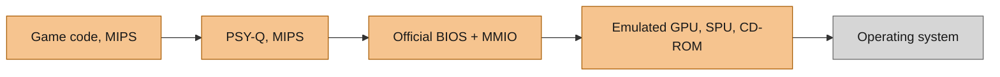
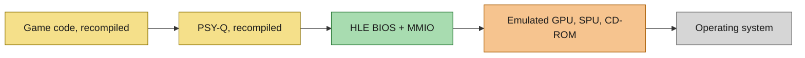
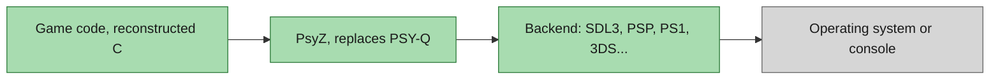

# PsyZ

PsyZ is a drop-in replacement for the PlayStation 1 Runtime Library called PSY-Q, allowing games designed for the PlayStation 1 to be compiled and run natively on any other platform.

PsyZ is not an emulator or a static recompiler. It is a porting library written in C that replaces the PSY-Q API with native counterparts. Currently, it targets multiple platforms, supporting both 32-bit and 64-bit architectures out of the box. The same applications and games will work on all platforms, including the PlayStation 1, with minimal changes.

PsyZ adheres to the PSY-Q library contracts, focusing on compatibility rather than accuracy. It does not aim to produce 1:1 output compared to real hardware and does not reproduce game bugs that rely on misuse of the PlayStation 1 hardware. The goal is to help port games and run them as native applications everywhere.

PsyZ also offers a GPU and SPU emulation layer, accessible through a list of emulated MMIO endpoints. It is theoretically possible to use PsyZ as a backend for new emulators and static recompilers.

## Supported platforms

The platforms currently supported include:

- **Linux** (i686, x86_64)
- **macOS** (ARM64)
- **iOS / iPadOS** (ARM64)
- **WebAssembly / WebGL 2** via Emscripten
- **Windows** (x86, x64, ARM64) with support for MSVC, Clang, and MinGW
- **PlayStation Portable** via its [dedicated backend](psyz/src/psp/README.md)

PsyZ is designed to be extensible, and support for additional platforms may be added in the future.

## PSY-Q decomp

To achieve a high level of API compatibility and accuracy, PsyZ uses decompiled PSY-Q code that matches the original binaries exactly. This decompilation is an ongoing process. Please navigate to the `decomp/` directory for more details.

This decomp is a spin-off of [sotn-decomp psxsdk](https://github.com/Xeeynamo/sotn-decomp/tree/master/src/main/psxsdk) and reuses from the [PSY-Q decomp by Sozud](https://github.com/sozud/psy-q-decomp).

## Integrate PsyZ SDK

Porting a PlayStation 1 game or application to PsyZ requires careful code modifications and build system integration to ensure compatibility across both the original PlayStation 1 hardware and modern platforms.

For a comprehensive guide, please refer to the **[Porting Guide](PORTING_GUIDE.md)**.

You can also look into the `samples/` directory for complete examples on how to set up a project to target both PlayStation 1 hardware and PsyZ on PC.

## Set up the PsyZ SDK

At the root of the directory run `make -j`. This will download PSY-Q SDK 4.7 and populate `nugget/psyq` with the transformed `include` and `lib` folders. PCSX Redux will also be downloaded to compile the tool `psyq-obj-parser`, necessary to generate the libraries. This might take a while.

This step is needed to cross-compile your source code against both PsyZ and PSY-Q. If you are not interested in cross-compiling your homebrew to both PlayStation 1 and PC, you can skip this step.

## Samples

Most of these examples are adaptations of the original PSY-Q SDK samples, designed to target both PS1 and all PsyZ platforms. This is achieved via [nugget](https://github.com/pcsx-redux/nugget).

These samples are frequently used to test the quality of PsyZ, assess its feature set and catch regressions.

## Architecture

### How PsyZ compares to an emulator and a recomp

- **Emulator**: runs the original game binary. It interprets (or recompiles) the MIPS CPU code at run time, boots the official BIOS and sends every hardware register access (MMIO) to emulated GPU, SPU and CD-ROM chips. PSY-Q is part of the game binary, so it is emulated too.
- **Recomp**: translates the MIPS CPU code into source code ahead of time, so the CPU work moves from run time to build time. The BIOS is replaced by a high-level (HLE) implementation. MMIO and the emulated GPU, SPU and CD-ROM stay the same as in an emulator, and the recompiled PSY-Q still sits between the game and them.
- **PsyZ**: compiles the game's decompiled source code natively. PSY-Q is replaced as a whole by PsyZ, which talks straight to the operating system through a backend. There is no BIOS, no MMIO and no emulated chips, and the same game runs anywhere.

**Emulator**

**Recomp**

**PsyZ**

ORANGE runs emulated at run time. YELLOW is recompiled at build time. GREEN is native code.

|                | PCSX-Redux (interpreter) | PCSX-Redux (dynarec) | SymphonyRecomp | PsyZ (-O3)  |
|----------------|--------------------------|----------------------|----------------|-------------|
| CPU % of usage | 16%                      | 10%                  | 16%            | 1%          |
| Frame render   | 2.67 ms                  | 1.67 ms              | 2.67 ms        | 0.17 ms     |
| GPU % busy     | 9%                       | 10%                  | 7%             | 3%          |
| RAM usage      | 465 MB                   | 473 MB               | 551 MB         | 387 MB      |
| VRAM usage     | 79 MB                    | 79 MB                | 114 MB         | 52 MB       |

- Measurement is done on Castlevania: Symphony of the Night, prologue stage.
- PCSX-Redux: build r7333, commit `55eafd76` (2026-07-18), stock settings, software GPU renderer.
- SymphonyRecomp: v0.5.1b (released 2026-08-19), on .NET 10.0.12.
- PsyZ: version 2026-10-03, through [sotn-decomp](https://github.com/Xeeynamo/sotn-decomp), built with GCC 16 at `-O3`, using hardware VSync.
- AMD Ryzen 9 7900X, GeForce RTX 5080 (driver 615.71.09), CachyOS on Wayland, sampled with `pidstat` once per second for 30 seconds.

### Source tree

The SDK is structured into three major folders:

#### src/psyz

Contains the core of the SDK. The majority of the SDK calls are reimplemented here. Whenever an API call is platform-specific, the call is redirected to an equivalent function with the `My` prefix (e.g., `LoadImage` internally calls `MyLoadImage`). All platform-specific code is located in `src/platform`.

#### src/platform

Platform-specific logic is found here. Each platform uses a subset of the source files in this folder. The build script instructs the linker to decide what platform-specific code needs to be used in the final executable. This means no `#ifdef` spam or function pointers. Everything is statically linked whenever possible.

#### decomp/src

All the code in this folder mirrors the original PSY-Q libraries and it is powered by the matching decompilation of PSY-Q. Currently it targets PSY-Q 4.0.

## Games using PsyZ

- [Castlevania: Symphony of the Night](https://github.com/Xeeynamo/sotn-decomp/)
- [Rayman 1](https://github.com/rayman-decomp/rayman-ps1-decomp/)
- [Final Fantasy VII](https://github.com/Xeeynamo/ff7-decomp)
- [Mega Man X4](https://github.com/sozud/mmx4)
- [Rage Racer](https://github.com/khasinski/rage-racer-psyz)
- [Metal Gear Solid 1](https://grain.saltindex.com/how-i-managed-to-run-metal-gear-solid-ps1-on-a-15-esp32-s3-8ebf2a478e3f), running bare metal on an ESP32

If you want your game to be listed here, please [submit an issue](https://github.com/Xeeynamo/psyz/issues/new).

## Why develop PsyZ?

Before starting this project, I tried using both [libValkyrie](https://github.com/Gh0stBlade/libValkyrie) and [PsyCross](https://github.com/OpenDriver2/PsyCross/). However, each presented its own challenges, such as lack of 64-bit support, insufficient documentation, missing samples, or inflexibility when porting to new platforms. PsyZ aims to solve these issues and more.

I also became increasingly fascinated by the PlayStation 1 hardware due to its simplicity and versatility. This project is a personal opportunity to learn more.

## Contributing

Contributions are welcome! If you find issues or want to add new features, please open an issue or submit a pull request. Ensure that any code you submit adheres to the project's coding standards and includes appropriate documentation.

## Special Thanks

Special thanks to [SoapyMan](https://github.com/SoapyMan) for the inspiration from their [PsyCross](https://github.com/OpenDriver2/PsyCross/) project.

Thanks to [grumpycoders/pcsx-redux](https://github.com/grumpycoders/pcsx-redux/) for their ongoing support to the PS1 development community and help.
